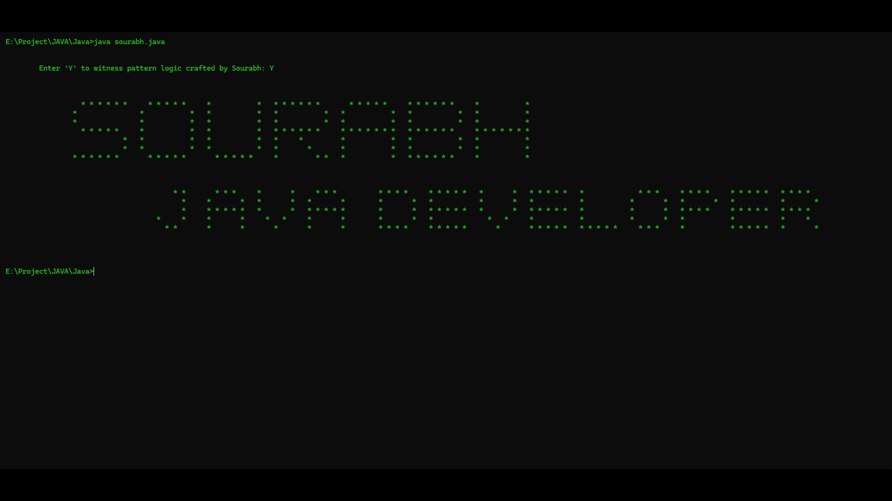

# Java Pattern Program – Print Name

This is a simple Java program that prints my name **Sourabh** and my role as a **Java Developer** in a creative **pattern format** using loops and conditions. 

---

## 📌 How to Run

```bash
# Step 1: Clone this repository
git clone https://github.com/sourabh-git-official/java-pattern-program.git

# Step 2: Go inside the project folder
cd java-pattern-program

# Step 3: Compile the Java file
javac Sourabh.java

# Step 4: Run the program
java Sourabh


## ✨ Example Output

Here is the sample output of the program:  


